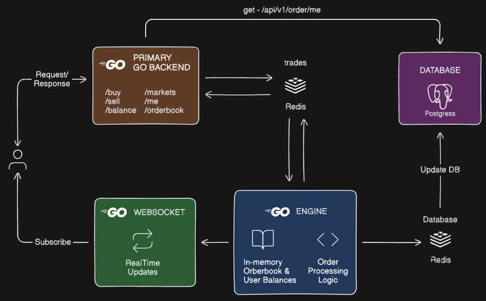

# 📈 Betwise – Decentralized Prediction Market Engine

**Betwise** is a high-performance engine for a decentralized **prediction market** platform, inspired by systems like [Polymarket](https://polymarket.com/). It allows users to buy and sell shares on the outcomes of future events with dynamic market-based pricing.



The architecture is designed to be modular, scalable, and real-time. Orders are processed in-memory for ultra-fast matching, while persistence and analytics are handled asynchronously via Redis-backed workers and PostgreSQL.

> Think of it as a mini NASDAQ for betting on real-world questions like:
> - "Will Bitcoin hit $100K by Dec 2025?"
> - "Will India win the Cricket World Cup 2027?"
> - "Will OpenAI release GPT-5 by Q2 2026?"

---

## 🎥 Demo

Check out the full working demo of Betwise in action:  
[▶️ Watch Demo](https://vimeo.com/1179316375?fl=pl&fe=sh)

---

## 🔥 Core Features

- ✅ Create new prediction markets
- 💰 Deposit INR (on-ramp)
- 🔄 Place Buy/Sell orders (market & limit)
- ⚖️ Real-time trade matching
- 📊 Track INR and stock balances
- 🧠 Redis-powered messaging
- 🗃️ Batched order persistence to PostgreSQL

---

## ⚙️ Tech Stack

- **Go (Golang)** — Backend logic
- **Gin** — HTTP framework
- **Redis** — Event queuing and pub/sub
- **PostgreSQL** — Main database
- **GORM** — ORM for PostgreSQL
- **Clerk.dev** — JWT-based auth
- **Custom Order Matching Engine** — In-memory, event-driven

---

## 🧠 System Architecture

```
                                  +--------------------+
                                  |    Frontend (FE)   |
                                  |  [betwise-fe repo] |
                                  +---------+----------+
                                            |
                                            v
                              +-------------+--------------+
                              |   Gin HTTP API Layer (BE)  |
                              |  (Handles REST + Auth via  |
                              |   Clerk + Validation)      |
                              +-------------+--------------+
                                            |
                                   Pushes request to Redis
                                            |
                                            v
                                +----------+-----------+
                                |  Redis Queue: input  |
                                +----------+-----------+
                                           |
                                  (consumed by Engine)
                                           |
                                           v
                      +--------------------+-----------------------+
                      |              🧠 Engine Worker             |
                      | - In-memory order book & matching engine   |
                      | - Processes order logic, market mgmt       |
                      |                                            |
                      | → Pushes result to:   output (for API)     |
                      | → Pushes deltas to:   order_events (for DB)|
                      +--------------------+-----------------------+
                                           |
                 +-------------------------+-------------------------+
                 |                                                   |
                 v                                                   v
    +-----------------------------+                   +-----------------------------+
    |    Redis Queue: output      |                   |   Redis Queue: order_events |
    | (read by order/worker.go)   |                   |   (read by DB worker)       |
    +-------------+---------------+                   +--------------+--------------+
                  |                                                   |
     +------------v------------+                         +------------v-------------+
     |  API reads & responds   |                         |     🗃️ DB Worker        |
     |  with result (trades,   |                         |  - Bulk inserts open     |
     |  balances, markets, etc)|                         |    orders                |
     +-------------------------+                         |  - Handles updates/match |
                                                         |  - Updates INR/stock     |
                                                         |    balances              |
                                                         +--------------------------+

```

---

## 🧠 How It Works

1. API receives a request like `POST /buy`.
2. API constructs an `Input` struct and sends it to Redis (`input` queue).
3. **Engine Worker** consumes `input`, processes the logic, and pushes:
   - Result to `output` (for API response)
   - Matching deltas to `order_events` (for DB persistence)
4. API reads from `output` and returns the result.
5. **Database Worker** reads `order_events` and:
   - Creates, updates, or deletes orders
   - Modifies INR and stock balances

---

## 🛠️ API Features

> All endpoints are prefixed with `/api/v1/order`

| Method | Endpoint                | Description                          | Auth Required |
|--------|-------------------------|--------------------------------------|---------------|
| POST   | `/create-market`        | Create a new binary market           | ✅ Yes         |
| POST   | `/buy`                  | Place a buy order                    | ✅ Yes        |
| POST   | `/sell`                 | Place a sell order                   | ✅ Yes        |
| POST   | `/on-ramp-inr`          | Add INR to account                   | ✅ Yes        |
| GET    | `/inr-balance`          | Get current INR balance              | ✅ Yes        |
| GET    | `/stock-balance`        | Get stock (yes/no) holdings          | ✅ Yes        |
| GET    | `/me`                   | Full user info (INR + portfolio)     | ✅ Yes        |
| GET    | `/orderbook`            | View order book for a symbol         | ❌ No         |
| GET    | `/market`               | Fetch a specific market              | ❌ No         |
| GET    | `/markets`              | Fetch all open markets               | ❌ No         |
| GET    | `/health`               | Health check                         | ❌ No         |

---

## 🧪 Example Order Payloads

### 🔼 Buy/Sell Order (Limit)

```json
{
  "symbol": "ELECTION2024",
  "quantity": 10,
  "price": 72,
  "stockSide": "yes",
  "stockType": "limit"
}
```

### 🧾 Create Market

```json
{
  "title": "India wins 2024 World Cup?",
  "question": "Will India win the 2024 Cricket World Cup?",
  "endTime": 1724450100000,
  "symbol": "INDIA_WC_2024"
}
```

---

## 🧬 File Structure

```
Probo/
├── cmd/main.go              # Entrypoint + router setup
├── internal/
│   ├── config/              # Config loading
│   ├── database/            # Redis/DB clients + DB Worker
│   ├── engine/              # Order matching engine + Redis consumer
│   ├── http/
│   │   └── handlers/order/  # All HTTP endpoints + order logic
│   ├── middlewares/         # JWT middleware using Clerk
│   ├── models/              # GORM models
│   └── types/               # Core types (Input, Output, Order, etc.)
```

---

## 🔗 Related Projects

- [🖥️ betwise-fe](https://github.com/varunarora1606/Betwise) – Next frontend for this backend
- [🎥 Redix (In-Memory DB)](https://github.com/varunarora1606/Redix) – Custom Redis clone used for learning

---

## 🏁 Getting Started

### Prerequisites

- Go 1.21+
- PostgreSQL
- Redis (running)
- Clerk.dev public key for auth

### Run Locally

```bash
git clone https://github.com/varunarora1606/Probo.git
cd Probo

# Set env vars
export DB_URL=...
export REDIS_URL=...
export CLERK_PUBKEY=...
export ADDRESS=:8080

go run main.go
```

---

## 👨‍💻 Author

Built by [Varun Arora](https://x.com/VarunArora80243)

---

## 📝 License

MIT
